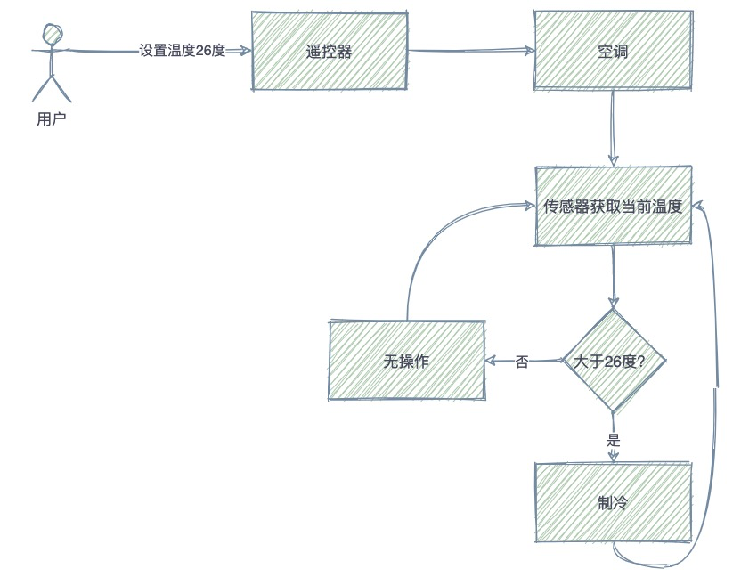
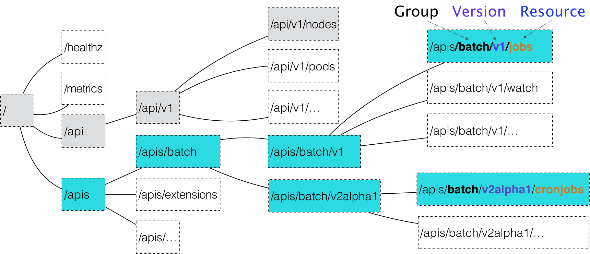
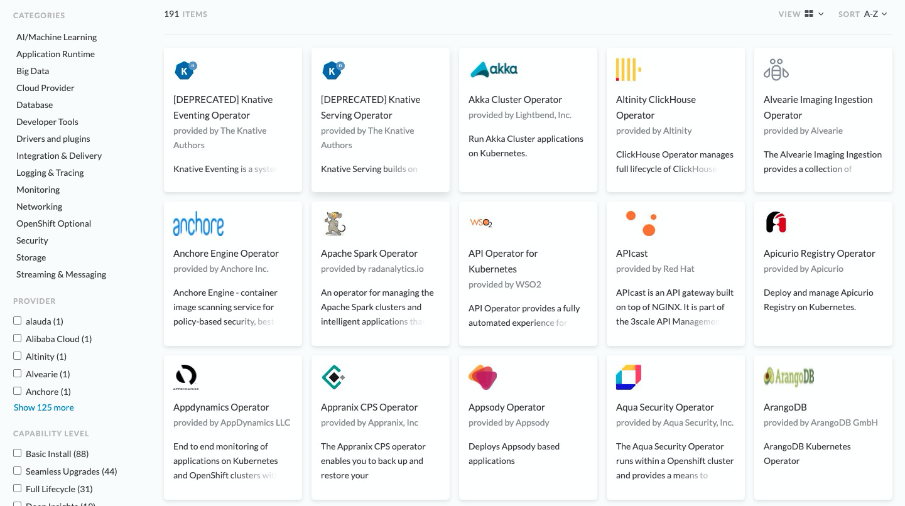

# operator概念

### **声明式**API

“命令式”和“声明式”的概念

“命令式”强调的是how，如果你是在写命令式的程序，那么你将step-by-step的告诉计算机如何完成一项工作，大多数的程序都是这样的。

 “声明式”有时也被成为“描述式”或者“申明式”，为告诉计算机你想要什么，“声明”你想要的what，由计算机自己去设计执行路径，需要计算机或者是“运行时”具备一定的“智能”。

## controller

在机器人技术和自动化中，*控制回路*是一种调节系统状态的非终止回路。

这是控制回路的一个示例：房间中的恒温器。

当您设置温度时，就是在告诉恒温器您*想要的状态*。实际室温是 *当前状态*。恒温器的作用是通过打开或关闭设备使当前状态更接近所需状态。

在 Kubernetes 中，控制器是监视您的状态的控制循环，然后根据需要进行更改或请求更改。每个控制器都试图将当前集群状态移动到更接近所需状态。



## 自定义资源(CRD)

要说自定义资源，先了解一下k8s内部的资源

包括下面几个属性

- prefix 前缀，包括apis等
- group 资源组
- version 资源版本
- resource 资源本身





通过以下命令可以查找具体的资源属于哪个groupversion

```
kubectl api-resources
kubectl api-versions
```


大部分资源都会有相应的一个controller对它进行维护(controller-manager中包含大量的controller)


kubernetes提供了用户自己注册新资源的方式，通过CustomResourceDefinition(CRD)定义新的资源类型，包括group、version，resource以及资源的具体属性

如下面的格式

```
apiVersion: apiextensions.k8s.io/v1
kind: CustomResourceDefinition
metadata:
  # 名字必需与下面的 spec 字段匹配，并且格式为 '<名称的复数形式>.<组名>'
  name: crontabs.stable.example.com
spec:
  # 组名称，用于 REST API: /apis/<组>/<版本>
  group: stable.example.com
  # 列举此 CustomResourceDefinition 所支持的版本
  versions:
    - name: v1
      # 每个版本都可以通过 served 标志来独立启用或禁止
      served: true
      # 其中一个且只有一个版本必需被标记为存储版本
      storage: true
      schema:
        openAPIV3Schema:
          type: object
          properties:
            spec:
              type: object
              properties:
                cronSpec:
                  type: string
                image:
                  type: string
                replicas:
                  type: integer
  # 可以是 Namespaced 或 Cluster
  scope: Namespaced
  names:
    # 名称的复数形式，用于 URL：/apis/<组>/<版本>/<名称的复数形式>
    plural: crontabs
    # 名称的单数形式，作为命令行使用时和显示时的别名
    singular: crontab
    # kind 通常是单数形式的驼峰编码（CamelCased）形式。你的资源清单会使用这一形式。
    kind: CronTab
    # shortNames 允许你在命令行使用较短的字符串来匹配资源
    shortNames:
    - ct
```

实际使用的时候可以执行kubectl apply -f 创建，也可以通过kubectl get cronTab 获取资源和原生操作方式一致

```
apiVersion: "stable.example.com/v1"
kind: CronTab
metadata:
  name: my-new-cron-object
spec:
  cronSpec: "* * * * */5"
  image: my-awesome-cron-image
```


## operator

Operator 是 Kubernetes 的软件扩展，它利用 [自定义资源](https://kubernetes.io/docs/concepts/extend-kubernetes/api-extension/custom-resources/) 来管理应用程序及其组件。Operator 遵循 Kubernetes 原则，尤其是[控制循环](https://kubernetes.io/docs/concepts/architecture/controller)。


可以那么理解

controller = k8s内部资源 + K8S内部资源处理逻辑

operator = crd + controller + 业务逻辑(涉及具体的业务组件、比如数据库、缓存等)


![1. Introduction - Programming Kubernetes [Book]](.assets/prku_0102.png)


operator-hub

OperatorHub.io 是 Kubernetes 社区共享 Operator 的网站。 可以从发现现有的operator。


