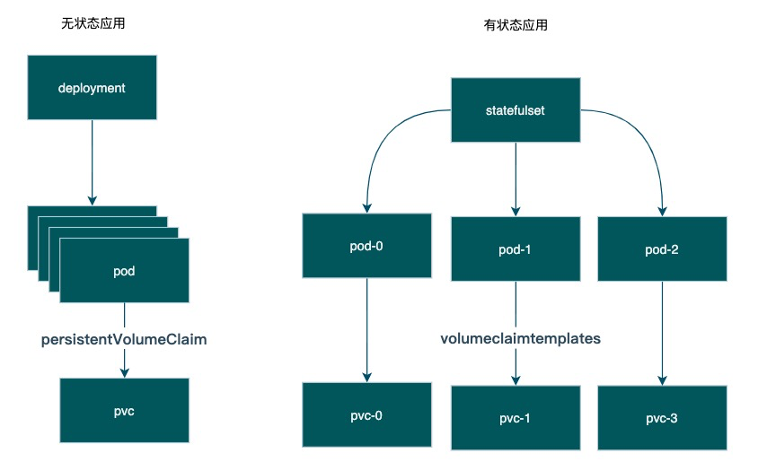
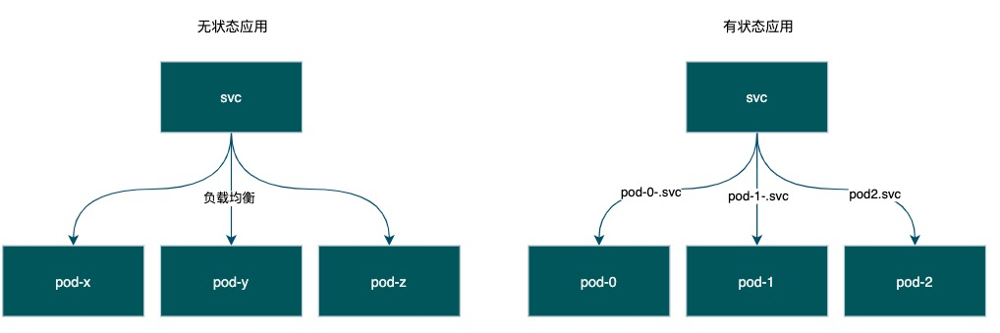

## 有状态应用

### 为什么需要statefulset

**无状态应用（Stateless Application）**是指应用不会在会话中保存下次会话所需要的客户端数据。每一个会话都像首次执行一样，不会依赖之前的数据进行响应。

有状态的应用（Stateful Application）**是指应用会在会话中保存客户端的数据，并在客户端下一次的请求中来使用那些数据。

但是像数据库、缓存等中间件就不适合采用有状态应用，1.是每个组件都会有数据卷依赖 2.多个单体之间存在关联，通常通过复制/分片等方式组成集群，互相之间会有影响

- **Pod会被顺序部署和顺序终结**：StatefulSet中的各个 Pod会被顺序地创建出来，每个Pod都有一个唯一的ID，在创建后续 Pod 之前，首先要等前面的 Pod 运行成功并进入到就绪状态。删除会销毁StatefulSet 中的每个 Pod，并且按照创建顺序的反序来执行，只有在成功终结后面一个之后，才会继续下一个删除操作。
- **Pod具有唯一网络名称**：Pod具有唯一的名称，而且在重启后会保持不变。通过Headless服务，基于主机名，每个 Pod 都有独立的网络地址，这个网域由一个Headless 服务所控制。这样每个Pod会保持稳定的唯一的域名，使得集群就不会将重新创建出的Pod作为新成员。
- **Pod能有稳定的持久存储**：StatefulSet中的每个Pod可以有其自己独立的PersistentVolumeClaim对象。即使Pod被重新调度到其它节点上以后，原有的持久磁盘也会被挂载到该Pod。
- **Pod能被通过Headless服务访问到**：客户端可以通过服务的域名连接到任意Pod。

### 存储卷模板(volumeclaimtemplates)

无状态应用使用**persistentVolumeClaim**来存储数据，即使有再多的副本，每个副本都只能公用数据卷

有状态应用可以通过配置**volumeclaimtemplates**，自动生成多个pvc，并让每个有状态实例挂载独立的数据卷

### 无头服务(headless service)

无状态应用，无法决定具体访问哪一个pod，因为通过service访问是随机的负载均衡

有状态应用，可以通过<podname>.<svcname> 访问到具体的pod实例，当然也可以支持负载均衡

