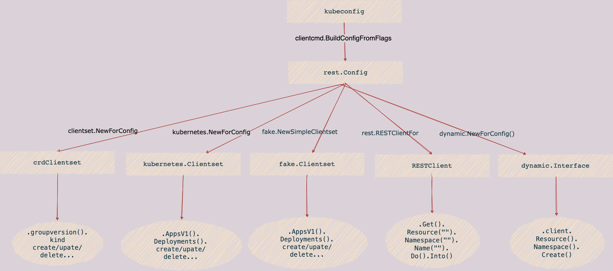

# client-go

client-go是一个调用kubernetes集群资源对象API的客户端，即通过client-go实现对kubernetes集群中资源对象（包括deployment、service、ingress、replicaSet、pod、namespace、node等）的增删改查等操作。大部分对kubernetes进行前置API封装的二次开发都通过client-go这个第三方包来实现。

主要的几个package包的功能说明：

- dynamic: 提供 DynamicClient 动态客户端。
- informers: 每种 K8S 资源的 Informer 实现。
- kubernetes: 提供 ClientSet 客户端。
- listers: 为每一个 K8S 资源提供 Lister 功能，该功能对 Get 和 List 请求提供只读的缓存数据。
- plugin: 提供 OpenStack，GCP 和 Azure 等云服务商授权插件。
- rest: 提供 RESTClient 客户端，对 K8S API Server 执行 RESTful 操作。
- scale: 提供 ScaleClient 客户端，用于扩容或缩容 Deployment, Replicaset, Replication Controller 等资源对象。
- tools: 提供常用工具，例如 SharedInformer, Relector, DealtFIFO 及 Indexers。提供 Client 查询和缓存机制
- transport: 提供安全的 TCP 连接，支持 HTTP Stream，某些操作需要在客户端和容器之间传输二进制流，例如 exec，attach 等操作。该功能由内部的 SPDY 包提供支持。
- util: 提供常用方法。例如 WorkQueue 工作队列，Certificate 证书管理等。

## config

通过kubectl命令通常需要kubeconfig文件作为访问集群的凭证, 如果没有手动指定该文件，默认会按照下面优先级寻找

- 集群内部
- 寻找路径~/.kube/config
- http://localhost:8080

## client

有了config以后，才可以初始化客户端访问k8s api-server

client-go 访问k8s一共有下面几种客户端类型，首先我用一个表格描述这几种客户端的描述和使用场合

- clientset(包括三种client) 
- dynamiClient
- restfulClient

client的应用场景

| client               |                                                              |      |
| -------------------- | ------------------------------------------------------------ | ---- |
| kubernetes.clientset | 针对标准包里面的资源进行处理，需要传入client.go内部定义的对象 |      |
| fake.clientset       | 虚拟的客户端，通常用在单元测试                               |      |
| <crd>.clientset      | 操作crd资源，需要手动生成代码                                |      |
| dynamiClient         | 动态客户端，不限定内部api, 可以操作crd资源。需要提供runtime.object的对象 |      |
| restfulClient        | 直接使用restful方式进行请求，提供http最底层的操作，需要提供unstructured的对象(map) |      |

编码参考

