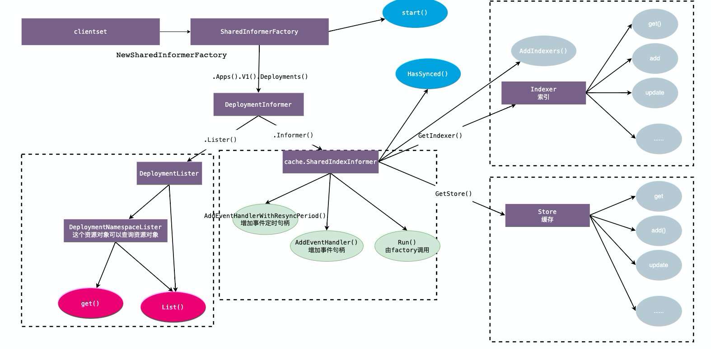

# Informer

## Informer架构

- Reflector list/watch 到本地
- Delta FIFO 事件队列
- Informer 事件通知
- Indexer  本地索引
- Store 本地缓存

## informer编码参考

1. 初始化rest.config

2. 初始化clientset(包含多个client，kubernetes.clientset/crd.client)

3. 通过clientset，初始化SharedInformerFactory

4. 通过Factory，首先获取Informer 接口 (提供方法可以获取cache.SharedIndexInformer 和 xxxLister)

5. 通过cache.SharedIndexInformer 设置事件的处理，xxxLister提供后期get/list方法

6. 执行Factory.start, 整个informer开始启动

7. 等待所有缓存建立(cache.WaitForCacheSync), informer启动完毕

8. 事件处理负责过滤并入队，并循环出队处理

   

