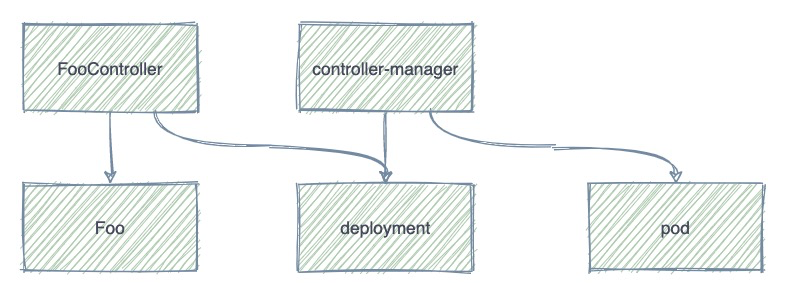
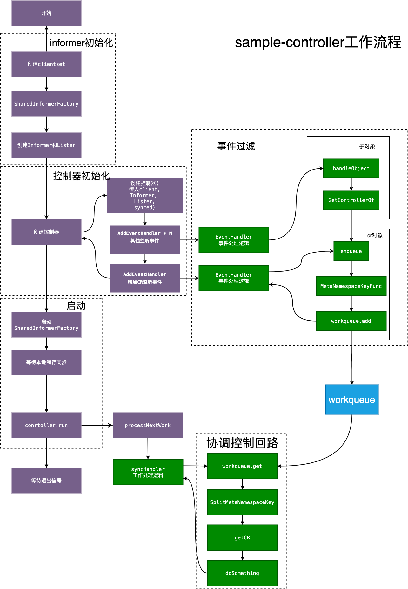
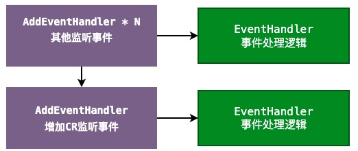
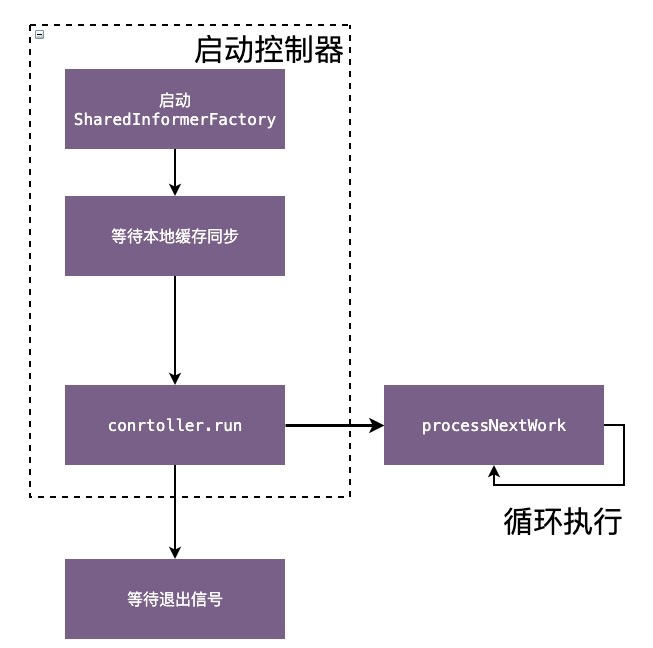
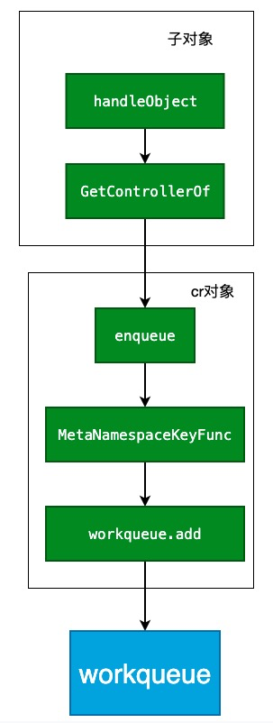
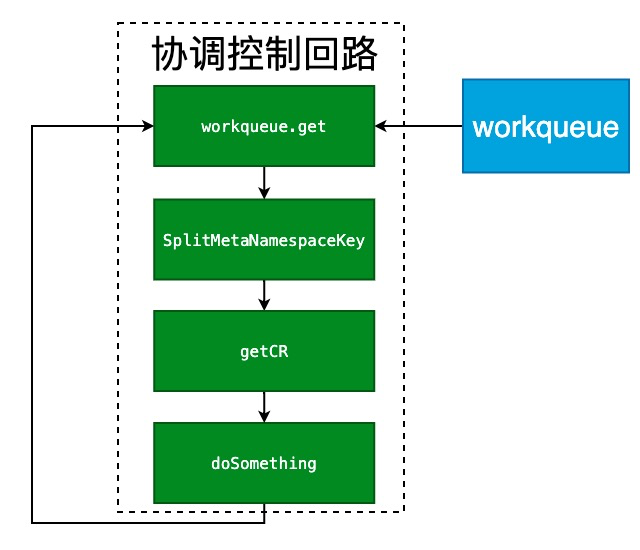

# sample-controller

## 介绍

https://github.com/kubernetes/sample-controller

Sample-controller 这个项目实现了一个简单的控制器，用于观察使用 CustomResourceDefinition (CRD) 定义的 Foo 资源。理解这个项目可以了解controller的工作原理


定义了一个资源foos.samplecontroller.k8s.io

通过执行下面的yaml文件

```
apiVersion: samplecontroller.k8s.io/v1alpha1
kind: Foo
metadata:
  name: example-foo
spec:
  deploymentName: example-foo
  replicas: 1
```


创建一个deployment，进而控制pod。主要通过deploymentName来控制deployemnt的name ，通过replicas控制deploy副本个数。



## 整体流程分析

- informer初始化
- 控制器初始化
- 过滤事件
- 控制器启动
- 自定义业务逻辑(主要核心编码)


理解下图的流程，主要编码的地方只有绿色的区块





## sample-controller代码分析

### controller核心结构体

```
type Controller struct {
	kubeclientset kubernetes.Interface
	sampleclientset clientset.Interface

	deploymentsLister appslisters.DeploymentLister
	deploymentsSynced cache.InformerSynced
	foosLister        listers.FooLister
	foosSynced        cache.InformerSynced

	workqueue workqueue.RateLimitingInterface
	recorder record.EventRecorder
}
```


包含以下几个属性

- clientset  包括k8s内部资源的clientset以及自定义资源的clientset 用于针对k8s资源的增删改查
- Lister 用于list资源对象
- Synced 启动时判断informer是否以及在本地做好了缓存
- workqueue 事件处理的队列
- recorder event记录


### Informer初始化

```
// 设置kubeconfig
cfg, err := clientcmd.BuildConfigFromFlags(masterURL, kubeconfig)

// 设置kubernetes.clientset
kubeClient, err := kubernetes.NewForConfig(cfg)

// crd.clientset
exampleClient, err := clientset.NewForConfig(cfg)

// 初始化k8s 的informerFactory 和 crd的informerFactory
kubeInformerFactory := kubeinformers.NewSharedInformerFactory(kubeClient, time.Second*30)
exampleInformerFactory := informers.NewSharedInformerFactory(exampleClient, time.Second*30)

// 获取deploymentInformer 以及 FooInformer 并传入
controller := NewController(kubeClient, exampleClient,
kubeInformerFactory.Apps().V1().Deployments(),
exampleInformerFactory.Samplecontroller().V1alpha1().Foos())
```


### 控制器初始化

NewController方法中

初始化controller

```
controller := &Controller{
		kubeclientset:     kubeclientset,
		sampleclientset:   sampleclientset,
		deploymentsLister: deploymentInformer.Lister(),
		deploymentsSynced: deploymentInformer.Informer().HasSynced,
		foosLister:        fooInformer.Lister(),
		foosSynced:        fooInformer.Informer().HasSynced,
		workqueue:         workqueue.NewNamedRateLimitingQueue(workqueue.DefaultControllerRateLimiter(), "Foos"),
		recorder:          recorder,
	}
```

增加EventHander,  主要针对foo 与 deployment时间监听，controller需要多cr本身和cr的子资源进行监听并响应变化

```
fooInformer.Informer().AddEventHandler(cache.ResourceEventHandlerFuncs{
	AddFunc: xxx
	UpdateFunc: xxx
})

deploymentInformer.Informer().AddEventHandler(cache.ResourceEventHandlerFuncs{
	AddFunc: xxx
	UpdateFunc: xxx
	DeleteFunc: xxx
})

```



### 启动控制器

启动InformerFactory，开始缓存数据到本地

```
kubeInformerFactory.Start(stopCh)
exampleInformerFactory.Start(stopCh)
```


启动controller

1. 等待etcd中的相应的资源数据缓存到本地
2. 无线循环运行方法runWorker

```
if err = controller.Run(2, stopCh); err != nil {
		klog.Fatalf("Error running controller: %s", err.Error())
}

func (c *Controller) Run(threadiness int, stopCh <-chan struct{}) error {
	...
	等待缓存建立
  if ok := cache.WaitForCacheSync(stopCh, c.deploymentsSynced, c.foosSynced); !ok {
      return fmt.Errorf("failed to wait for caches to sync")
    }
    
  ...
  执行runWorker
  for i := 0; i < threadiness; i++ {
    go wait.Until(c.runWorker, time.Second, stopCh)
  }
}

runWorker就是一个循环体，一直执行
func (c *Controller) runWorker() {
	for c.processNextWorkItem() {
	}
}
```




### 过滤事件

过滤事件中，主要就是将cr与deployment的变化进行通知

为什么不需要关注pod, 因为controller-manager已经会将pod的更新的时间反馈到deployment，所需不需要关注pod


#### 自定义资源入队

主要调用enqueueFoo方法进行入队

```
...
  AddFunc: controller.enqueueFoo,
	UpdateFunc: func(old, new interface{}) {
			controller.enqueueFoo(new)
		},
...

func (c *Controller) enqueueFoo(obj interface{}) {
	var key string
	var err error
	if key, err = cache.MetaNamespaceKeyFunc(obj); err != nil {
		utilruntime.HandleError(err)
		return
	}
	c.workqueue.Add(key)
}

func MetaNamespaceKeyFunc(obj interface{}) (string, error) {
...
		return meta.GetNamespace() + "/" + meta.GetName(), nil
}
```

#### deployment资源入队

主要调用handleObject方法入队，

通过GetControllerOf方法获取ownerReferences中的自定义资源信息(一般有父对象，都会在创建资源的时候在ownerReferences属性声明父资源), 然后再调用上面的enqueueFoo方法入队

```
...
		AddFunc: controller.handleObject,
		UpdateFunc: func(old, new interface{}) {
			controller.handleObject(new)
		},
		DeleteFunc: controller.handleObject,
...

func (c *Controller) handleObject(obj interface{}) {
	object, ok = tombstone.Obj.(metav1.Object)
	if ownerRef := metav1.GetControllerOf(object); ownerRef != nil {
		if ownerRef.Kind != "Foo" {
			return
		}

		foo, err := c.foosLister.Foos(object.GetNamespace()).Get(ownerRef.Name)
		c.enqueueFoo(foo)
		return
	}
}

```



### 控制协调回路


从队列中取出并执行syncHandler方法

```
c.workqueue.Get()
...
c.syncHandler(key)
...
c.workqueue.Forget(obj)
```


1. 获取Foo资源，

2. 并查找deployment，如果没有找到deployemnt，则创建deployment
3. 如果deployment中的replicas 与 cr中的不一致，则更新deployment

```
func (c *Controller) syncHandler(key string) error {
	namespace, name, err := cache.SplitMetaNamespaceKey(key)
	foo, err := c.foosLister.Foos(namespace).Get(name)
	
	// 如果没有deployment，则创建
	deploymentName := foo.Spec.DeploymentName
	deployment, err := c.deploymentsLister.Deployments(foo.Namespace).Get(deploymentName)
	if errors.IsNotFound(err) {
		deployment, err = c.kubeclientset.AppsV1().Deployments(foo.Namespace).Create(context.TODO(), newDeployment(foo), metav1.CreateOptions{})
	}
	
	// 副本数不一致，更新
	if foo.Spec.Replicas != nil && *foo.Spec.Replicas != *deployment.Spec.Replicas {
	  klog.V(4).Infof("Foo %s replicas: %d, deployment replicas: %d", name, *foo.Spec.Replicas, *deployment.Spec.Replicas)
	  deployment, err = c.kubeclientset.AppsV1().Deployments(foo.Namespace).Update(context.TODO(), newDeployment(foo), metav1.UpdateOptions{})
	}
}
```


这里只是实现最基础的逻辑，当然完全可以实现根复杂的逻辑。 





## 总结

以上就是所有sample-controller的原理

