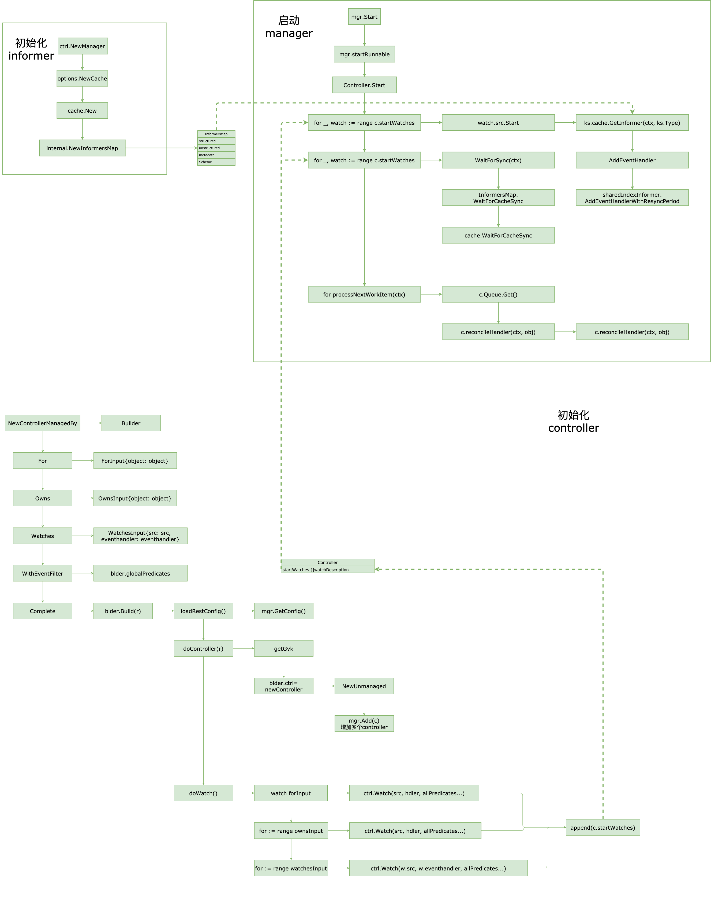

# 主要逻辑源码





## 初始化informer

## 构建控制器(SetupWithManager)

- 新建controller结构体
- 设置入队的方式

SetupWithManager中进行处理

```
func (r *MemcachedReconciler) SetupWithManager(mgr ctrl.Manager) error {
	return ctrl.NewControllerManagedBy(mgr).
		For(&cachev1alpha1.Memcached{}).
		Owns(&appsv1.Deployment{}).
		Complete(r)
}
```

### 构建controller(Complete方法中)

```
func (blder *Builder) Complete(r reconcile.Reconciler) error {
	_, err := blder.Build(r)
	return err
}

func (blder *Builder) Build(r reconcile.Reconciler) (controller.Controller, error) {
	blder.doController(r)
}
```


```
func (blder *Builder) doController(r reconcile.Reconciler) error {
	gvk, err := getGvk(blder.forInput.object, blder.mgr.GetScheme())
	blder.ctrl, err = newController(blder.getControllerName(gvk), blder.mgr, ctrlOptions)
}
```


###  入队

提供了For 和 own方法

for方法配置变量ForInput，own方法配置变量OwnsInput


```
func (blder *Builder) Build(r reconcile.Reconciler) (controller.Controller, error) {
	 blder.doWatch()
}
```


提供了EventHandler接口

```
type EventHandler interface {
	// Create is called in response to an create event - e.g. Pod Creation.
	Create(event.CreateEvent, workqueue.RateLimitingInterface)

	// Update is called in response to an update event -  e.g. Pod Updated.
	Update(event.UpdateEvent, workqueue.RateLimitingInterface)

	// Delete is called in response to a delete event - e.g. Pod Deleted.
	Delete(event.DeleteEvent, workqueue.RateLimitingInterface)

	// Generic is called in response to an event of an unknown type or a synthetic event triggered as a cron or
	// external trigger request - e.g. reconcile Autoscaling, or a Webhook.
	Generic(event.GenericEvent, workqueue.RateLimitingInterface)
}
```


默认主要有 EnqueueRequestForObject 与EnqueueRequestForOwner 2类

### EnqueueRequestForObject

实现了cr本身的入队

```
func (e *EnqueueRequestForObject) Create(evt event.CreateEvent, q workqueue.RateLimitingInterface) {
	if evt.Object == nil {
		enqueueLog.Error(nil, "CreateEvent received with no metadata", "event", evt)
		return
	}
	q.Add(reconcile.Request{NamespacedName: types.NamespacedName{
		Name:      evt.Object.GetName(),
		Namespace: evt.Object.GetNamespace(),
	}})
}
```


### EnqueueRequestForOwner

实现了将OwnersReferences中的对象(也就是父对象cr)进行入队

```
func (e *EnqueueRequestForOwner) Create(evt event.CreateEvent, q workqueue.RateLimitingInterface) {
	for _, req := range e.getOwnerReconcileRequest(evt.Object) {
		q.Add(req)
	}
}
```

```
func (e *EnqueueRequestForOwner) getOwnerReconcileRequest(object metav1.Object) []reconcile.Request {
  for _, ref := range e.getOwnersReferences(object) {
		result = append(result, request)
  }
  ...
}
```


### 自定义入队

## 控制器运行


### 初始化informer

```
func New(config *rest.Config, options Options) (Manager, error) {
	cache, err := options.NewCache(...)

}
```


```
func New(config *rest.Config, opts Options) (Cache, error) {
	...
	im := internal.NewInformersMap(config, opts.Scheme, opts.Mapper, *opts.Resync, opts.Namespace)
	return &informerCache{InformersMap: im}, nil
}
```


返回三类informer （structured/unstructured/metadata）

```
func NewInformersMap(...) *InformersMap {

	return &InformersMap{
		structured:   newStructuredInformersMap(config, scheme, mapper, resync, namespace),
		unstructured: newUnstructuredInformersMap(config, scheme, mapper, resync, namespace),
		metadata:     newMetadataInformersMap(config, scheme, mapper, resync, namespace),

		Scheme: scheme,
	}
}
```


### 控制器启动

#### 初始化informer


#### 启动控制器

- 获取informer
- 等待缓存建立
- processNextWorkItem

```
func (c *Controller) Start(ctx context.Context) error {
		for _, watch := range c.startWatches {
			c.Log.Info("Starting EventSource", "source", watch.src)
			if err := watch.src.Start(ctx, watch.handler, c.Queue, watch.predicates...); err != nil {
				return err
			}
		}
		
		for _, watch := range c.startWatches {
			syncingSource.WaitForSync(ctx)
    }
		
		for i := 0; i < c.MaxConcurrentReconciles; i++ {
			go wait.UntilWithContext(ctx, func(ctx context.Context) {
				// Run a worker thread that just dequeues items, processes them, and marks them done.
				// It enforces that the reconcileHandler is never invoked concurrently with the same object.
				for c.processNextWorkItem(ctx) {
				}
			}, c.JitterPeriod)
		}
}
```

获取informer

```
func (ks *Kind) Start(...) error {
		i, err := ks.cache.GetInformer(ctx, ks.Type)
		i.AddEventHandler(internal.EventHandler{Queue: queue, EventHandler: handler, Predicates: prct})
	}
```

获取informer, 从InformersMap中获取informer

```
func (ip *informerCache) GetInformer(ctx context.Context, obj client.Object) (Informer, error) {
	gvk, err := apiutil.GVKForObject(obj, ip.Scheme)
	if err != nil {
		return nil, err
	}

	_, i, err := ip.InformersMap.Get(ctx, gvk, obj)
	if err != nil {
		return nil, err
	}
	return i.Informer, err
}
```

