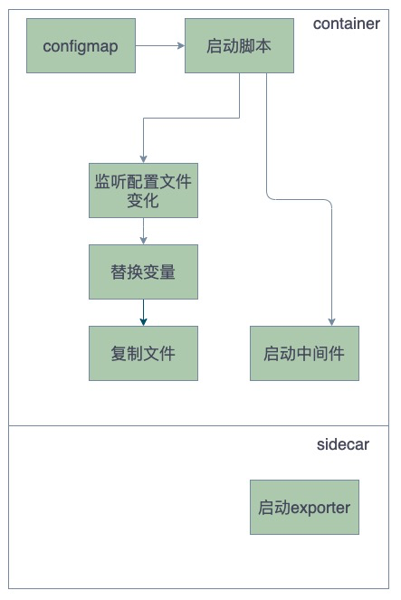

# 镜像制作

## 镜像架构

## container

### 配置文件管理

需要满足下面条件

由于有状态应用大部分情况下每个实例的配置多多少少都会出现区别，比如需要配置实例的ip，实例的id等信息，所以需要在配置文件

首先有些组件在启动时候会动态修改一些信息，这就需要保证配置文件是可读可写的权限，所以无法通过configmap直接挂载

### 组件启动

## exporter

