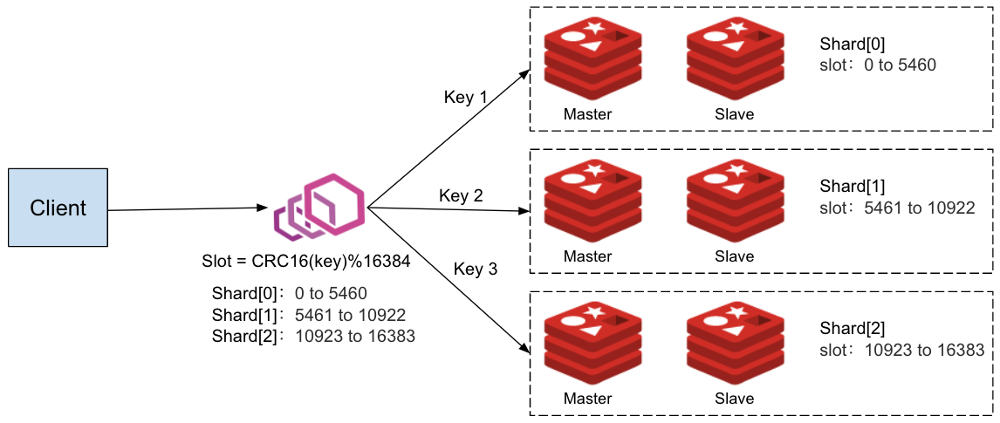

# redis cluster简述

## Redis是什么

Redis是一个使用ANSI C编写的开源、支持网络、基于内存、分布式、可选持久性的键值对存储数据库。

## reids主从复制

为了使得集群在一部分节点下线或者无法与集群的大多数（majority）节点进行通讯的情况下， 仍然可以正常运作， Redis 集群对节点使用了主从复制功能： 集群中的每个节点都有 `1` 个至 `N` 个复制品（replica）， 其中一个复制品为主节点（master）， 而其余的 `N-1` 个复制品为从节点（slave）。


### 设置

1. 配置文件中加入

   ```
   slaveof <masterip> <masterport>
   ```

2. 启动参数加入

   ```
    --slaveof <masterip> <masterport>
   ```

3. 命令行动态配置 

   ```
   slaveof <masterip> <masterport>
   ```

## redis cluster模式

Redis 集群是一个可以在多个 Redis 节点之间进行数据共享的设施（installation）。

Redis 集群通过分区（partition）来提供一定程度的可用性（availability）： 即使集群中有一部分节点失效或者无法进行通讯， 集群也可以继续处理命令请求。

### 数据槽slots

Redis 集群使用数据分片（sharding）而非一致性哈希（consistency hashing）来实现： 一个 Redis 集群包含 16384 个哈希槽（hash slot）， 数据库中的每个键都属于这 16384 个哈希槽的其中一个， 集群使用公式 CRC16(key) % 16384 来计算键 key 属于哪个槽， 其中 CRC16(key) 语句用于计算键 key 的 CRC16 校验和 。

集群中的每个节点负责处理一部分哈希槽。 举个例子， 一个集群可以有三个哈希槽， 其中：

节点 A 负责处理 0 号至 5500 号哈希槽。

节点 B 负责处理 5501 号至 11000 号哈希槽。

节点 C 负责处理 11001 号至 16384 号哈希槽。




## 搭建集群

### 快速创建主从集群

自定创建主从集群，指定副本数量为1，master和slave自动管理

```
/redis-cli --cluster create 192.168.163.132:6379 192.168.163.132:6380 192.168.163.132:6381 192.168.163.132:6382 192.168.163.132:6383 192.168.163.132:6384 --cluster-replicas 1
```


### 自定义创建集群

创建master

```
redis-cli --cluster add-node 192.168.163.132:6382 192.168.163.132:6379 192.168.163.132:6385 
```

为master增加slave

```
```


## 验证集群

